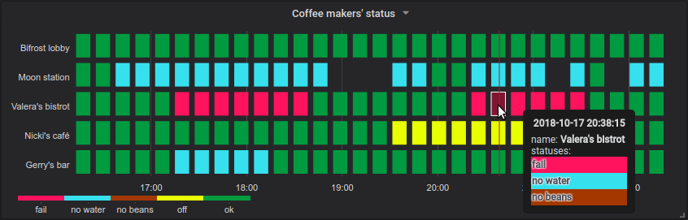

# Interface Metric Collectors

As a network engineer I need to monitor the health of interfaces beyond the common features
provided by SNMP collectors.  For example:

**Link Uptime** - I want to be able to see interface link uptime values over a period of time so
I can determine link-flaps.  I want to be able to store the metric as interface uptime in minutes, and
then use that value to set my own thresholds for what I want to watch out for.  For example, I might
want to set a thresholds for 5min, 30min, and 1hr; and color each of those metrics over time
red, yellow, blue.  I can then use a Grafana [Status-Map](https://grafana.com/grafana/plugins/flant-statusmap-panel) dashboard visualization.

Example from Grafana page:

# Device Support
   * Arista EOS via EAPI
   * Cisco NX-OS via NXAPI
   * Cisco NX-OS via SSH

